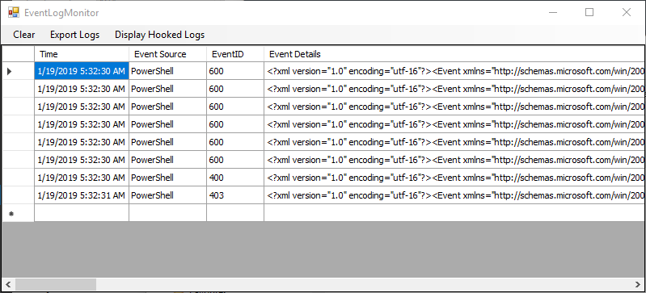
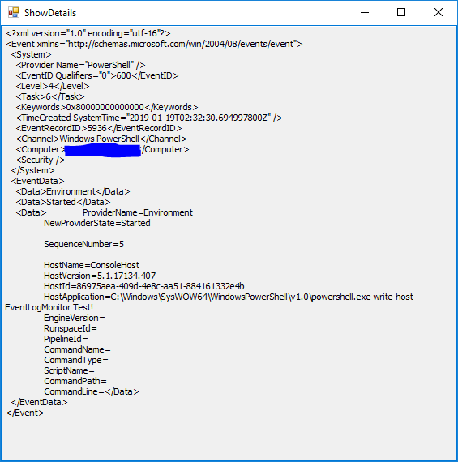

# EventLogMonitor

This simple .NET software is used to hook event logs and display any changes in a table. Also it is possible to export the captured logs as XML.

## instlation

You can clone this repository then build it your self or download the binary from the release tab.

## Screenshots

# Changelog
##### v2.1
* Fix a bug where the details column is displyed in the event id column.
* Added Tooltip on the log details cells
##### v2.0
* Added Start / Stop log monitoring feature.
* Bug fixes and general improvements.
##### v1.0
* Initial Version
